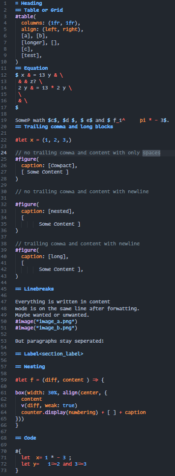
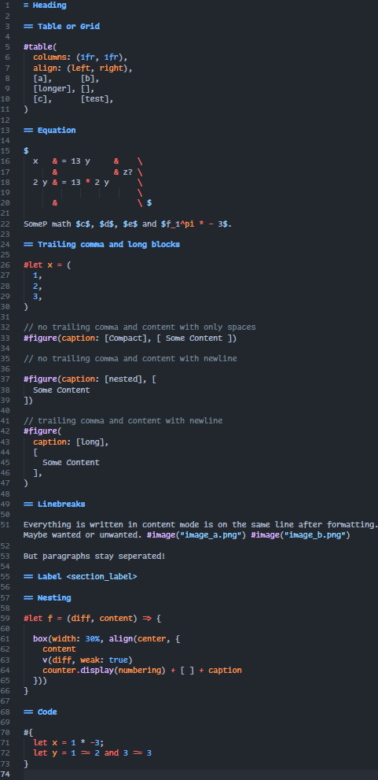
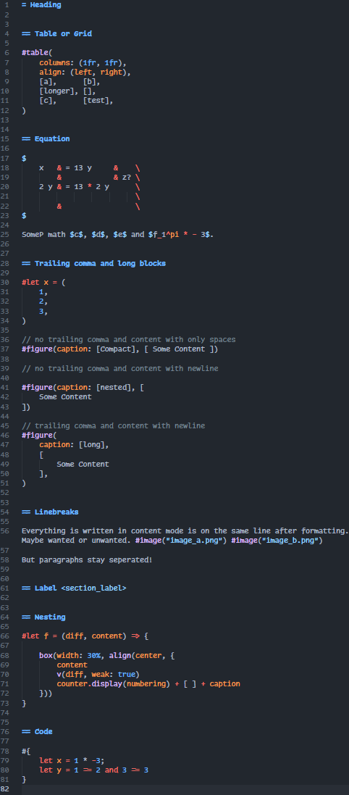

# Prettypst


## Formatter for Typst!

|                 Before                  |            Default Style             |           OTBS Style           |
| :-------------------------------------: | :----------------------------------: | :----------------------------: |
|  |  |  |


## Install

	cargo install --git https://github.com/antonWetzel/prettypst.git

## Usage

- Prettypst might change your work, use only if you can recover a previous version.
- Insert or remove trailing comma to change between single line and multiline

### Terminal

	prettypst [--help]                          | Print help
	prettypst <file>                            | Format file inplace
	prettypst --use-std-in ...                  | Use terminal as input
	prettypst ... -o <output-file>              | Change output file
	prettypst ... --use-std-out                 | Use terminal as output
	prettypst --style=[default | otbs] ...      | Change the used style
	prettypst --use-configuration ...           | Load a configuration from "prettypst.toml"
	prettypst --file-location=<path> ...        | Change file location to search for configuration (use with --use-std-in)
## VSCodium or VSCode

- install custom-local-formatters
- use prettypst for typst
	- ```json
		"customLocalFormatters.formatters": [
			{
				"command": "prettypst --use-std-in --use-std-out --file-location=${file}",
				"languages": [
					"typst",
				],
			}
		],```
- change command to use wanted style or configuration
	- `--style=otbs`
	- `--use-configuration`

## Settings

- create configuration with `prettypst [--style=otbs] --save-configuration`

```toml
indentation = 0 | 1 | ... # use 0 for tabs
seperate_label = false | true # insert space before a label
final_newline = false | true # insert a final newline at the end

[preserve_newline]
content = false | true # preserve single newlines in markup
math = false | true # preserve single newline in equations

[block]
long_block_style = "Seperate" | "Compact" # '[' and ']' on the same or seperate lines as the content

[term]
space_before_colon = false | true # insert a space before the ':' in terms
space_after_colon = false | true # insert a space after the ':' in terms

[named_argument]
space_before_colon = false | true # insert a space before the ':' in named arguments
space_after_colon = false | true # insert a space after the ':' in named arguments

[dictionary_entry]
space_before_colon = false | true # insert a space before the ':' in dictionary entries
space_after_colon = false | true # insert a space after the ':' in dictionary entries

[columns]
comma = "EndOfContent" | "EndOfCell" # how to align commas in tables

[heading]
blank_lines_before = 0 | 1 | ... # blank lines before a heading
blank_lines_after = 0 | 1 | ... # blank lines after a heading
```
